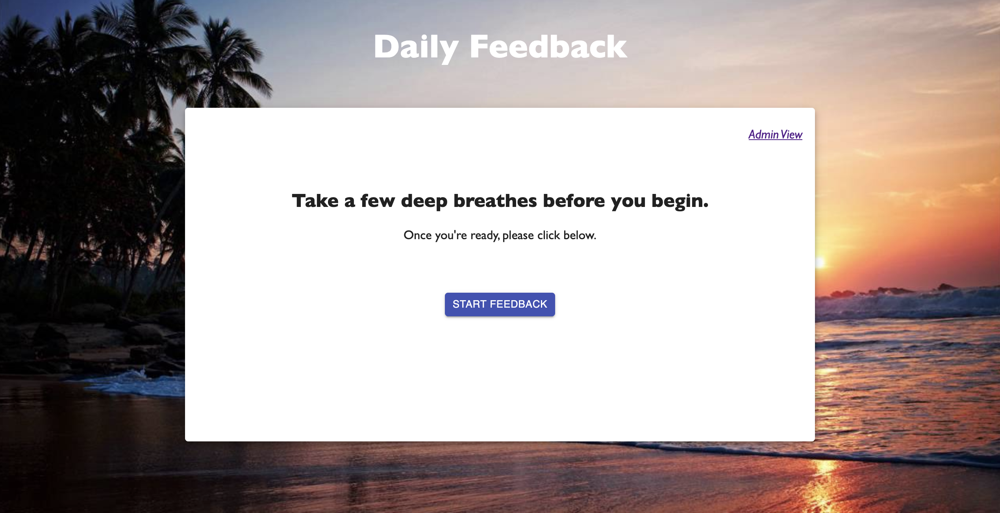
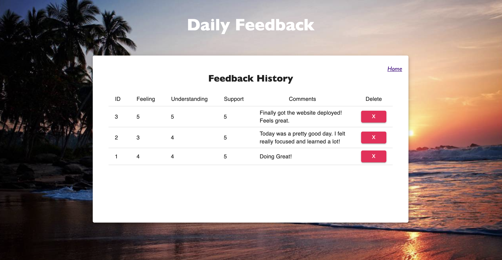

# Feedback Tracker

_Duration: 18 hours_

At my school we had a problem with how we submitted our daily feedback, it was very inefficient. The process was very manual and consisted of all of us writing out on paper how we are doing. We answered a series of questions then left our paper on the professors desk which created a huge mess. The professor had a hard time keeping track of all the feedback submissions and wanted a digital way to submit and store everything.

I offered to build my professor a website and he was very excited! I built a multi-page web application that allows a student to navigate views and answer multiple feedback questions, including adding a comment. Towards the end of the application the student is able to review their response, go back and edit, and submit when finished. Once the student submits their response it gets sent to a back end database that stores their response along with all others. Now the professor has access to view all responses by clicking "Admin View" on the home page. The professor is also able to delete responses if need be.

To see the fully functional site, please visit: <a target="_blank" href="https://feedback-ihansy.herokuapp.com/#/">Deployed App</a>

## Screen Shots

This is the home page where a student will start their feedback. The professor can click "Admin View" to view all responses.

This is the admin page where the professor can view all submissions and delete any if needed.

### Prerequisites

If you plan to clone and run this application, first install Node.js:

- [Node.js](https://nodejs.org/en/)

## Installation

1. Create a database named `prime_feedback`.
2. The queries in the `data.sql` file are set up to create all the necessary tables and populate the needed data to allow the application to run correctly. The project is built on [Postgres](https://www.postgresql.org/download/), so you will need to make sure to have that installed. We recommend using Postico to run those queries as that was used to create the queries.
3. Open up your editor of choice and run an `npm install`.
4. Run `npm run server` in your terminal.
5. Run `npm run client` in your terminal.
6. The `npm run client` command will open up a new browser tab for you!

## Usage

1. Starting on the home page, click 'Start Feedback'.
2. Continue with the questions and hit next when filled in.
3. Feel free to add a comment, but this is optional.
4. On the review page you can go back and edit your responses or click 'Submit'.
5. Find the feedback history by clicking 'Admin View' on the home page.

## Technologies used

Prime stack -
- Index.html
- CSS
- JavaScript
- Node.js
- React.js
- Redux.js
- Express
- PostgreSQL

## Acknowledgement
Thanks to [Prime Digital Academy](www.primeacademy.io) who equipped and helped me to make this application a reality. Also huge thanks to my cohort Rabin and my family!

## Support
If you have suggestions or issues, please email me at Hansolo6283@gmail.com